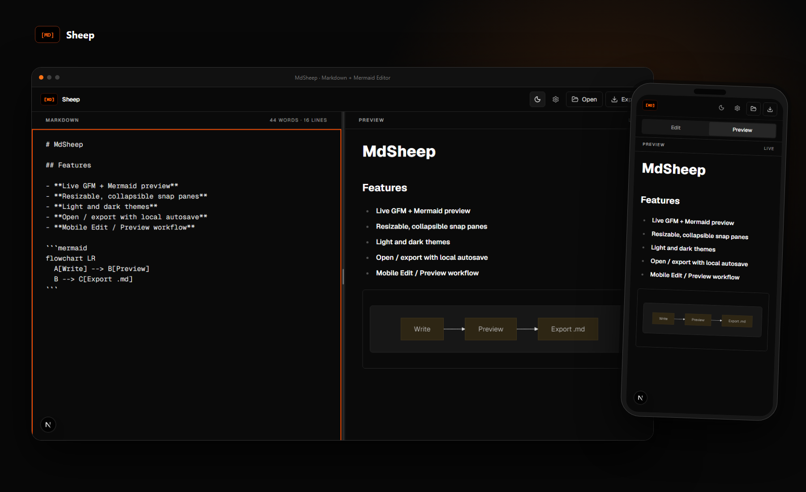

# MdSheep Tauri

> **In active preparation:** this is the new home of MdSheep. I am preparing this version to run natively across multiple devices and operating systems. The original web repository, [mdsheep-app](https://github.com/warunsinx/mdsheep-app), will be deprecated in favor of this native application.

MdSheep is a small, local-first Markdown reader and editor with live Mermaid support. This edition is built with Tauri v2, React, TypeScript, Vite, and Rust so it can become a native multi-device, multi-OS application without giving up the simple editor experience.



## Project status

This repository is the successor to [`mdsheep-app`](https://github.com/warunsinx/mdsheep-app). Native desktop support is working on Windows, while broader operating-system and device packaging is being prepared and tested.

The previous web implementation remains available during the transition, but it is planned for deprecation. New native and cross-platform work belongs here.

## Features

- Live GitHub Flavored Markdown preview
- Mermaid diagrams rendered as you type
- Native `.md` and `.markdown` Open and Export dialogs
- Local autosave using the original MdSheep storage keys
- Light and dark themes
- Resizable and collapsible desktop panes with keyboard controls and snap points
- Responsive Edit and Preview views down to mobile-sized layouts
- Adjustable typography, line spacing, wrapping, spellcheck, and document statistics
- External HTTP(S) and mail links opened through the operating system
- Sanitized Markdown and strict-mode Mermaid rendering

## Development

Requirements: Node.js/npm, Rust, and the [Tauri v2 platform prerequisites](https://v2.tauri.app/start/prerequisites/).

```bash
git clone https://github.com/warunsinx/mdsheep-tauri-app.git
cd mdsheep-tauri-app
npm install
npm run tauri dev
```

The frontend alone is available with `npm run dev` at `http://127.0.0.1:5173`. Native Open, Export, and external-link operations require the Tauri runtime.

## Verification

```bash
npm run typecheck
npm run lint
npm test
npm run test:e2e
npm run build
cargo check --manifest-path src-tauri/Cargo.toml
npm run tauri build
```

Playwright browsers can be installed with:

```bash
npx playwright install chromium webkit
```

Windows bundles are emitted under `src-tauri/target/release/bundle/`.

## Security and privacy

MdSheep does not upload your documents to a server. Markdown raw HTML is not rendered; output is restricted by `rehype-sanitize`. Mermaid uses strict security mode and its SVG is sanitized with DOMPurify. Native file access is limited to explicit user-selected paths, and the Tauri capability grants only the operations the application uses.

## Previous web version

The original Next.js implementation is at [`warunsinx/mdsheep-app`](https://github.com/warunsinx/mdsheep-app). It is retained temporarily for the hosted web version and migration history, but this repository is its intended replacement.
